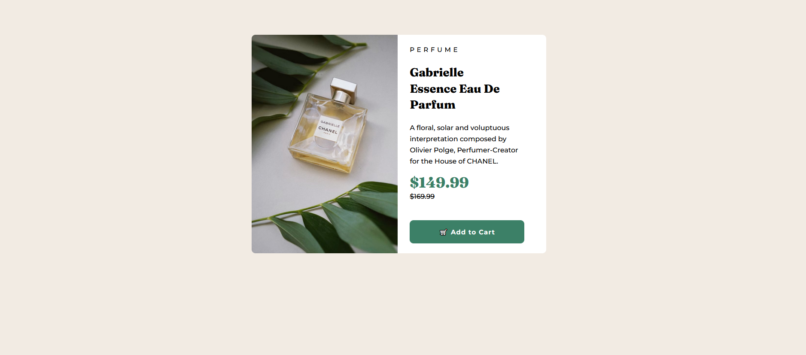

# Frontend Mentor - Product preview card component solution

This is a solution to the [Product preview card component challenge on Frontend Mentor](https://www.frontendmentor.io/challenges/product-preview-card-component-GO7UmttRfa). Frontend Mentor challenges help you improve your coding skills by building realistic projects.

## Table of contents

- [Overview](#overview)
  - [The challenge](#the-challenge)
  - [Screenshot](#screenshot)
  - [Links](#links)
- [My process](#my-process)
  - [Built with](#built-with)
  - [What I learned](#what-i-learned)
  - [Continued development](#continued-development)
- [Author](#author)

## Overview

### The challenge

Users should be able to:

- View the optimal layout depending on their device's screen size
- See hover and focus states for interactive elements

### Screenshot

This is the screenshot for my solution for this challenge.

### Links

- Live Site URL: [https://product-preview-card-v1.netlify.app/](https://your-live-site-url.com)

## My process

I started off initally drawing the whole site. I'd then outline sections that I think could be wrapped in a div or semantic HTML i.e main
header, or section. I started off working on the structure in HTML first then I'd work on the styling through CSS. I sometimes will go back and forth between HTML and CSS if I need to adjust part of the structure.

### Built with

- Semantic HTML5 markup
- CSS
- Flexbox

### What I learned

I learned using the   tag can be helpful to create how I want the new lines to look. It can also be another tool to use instead of having to shrink the content with margin, padding or width to have the text wrapped in a certain way.
I'm starting like the responsiveness of flexbox and how its a nice alternative instead of having to set a width. I want to start using flexbox more often.
Using the  tag for a picture instead of a 
 tag can be useful when it comes to retaining the size of the image even after setting its wdith. Not sure if I did something wrong but, when an img is wrapped in a 
 tag and your adding space, or padding around. It can cause the image to lose its size.

### Continued development

I think I've gotten close to this as possbile. And I want to avoid falling into the trap of having my work look pixel perfect to the original as it won't really help me that much in improving my skills overall.

## Author

- Frontend Mentor - [@y@Yosef-Solomon19](https://www.frontendmentor.io/profile/yourusername)
